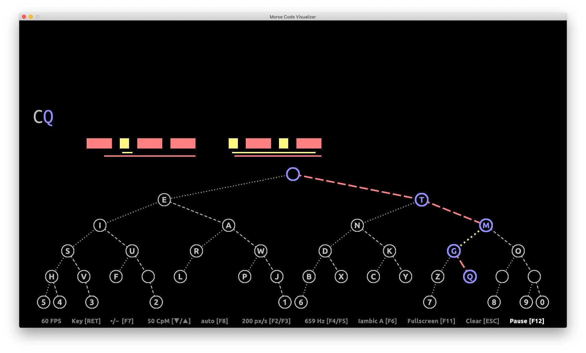

# Morse Code Visualizer

Visual [morse code](https://en.wikipedia.org/wiki/Morse_code) decoder (not only) for the [Raspberry Pi](https://en.wikipedia.org/wiki/Raspberry_Pi).

This a rewrite of [morse](https://github.com/malteschmitz/morse) using [Gosu](https://www.libgosu.org/) for Ruby.

## Features

* Decode morse code given either with keys on the keyboard or via an actual morse key attached at the serial port.
* Encode text entered via keyboard.
* Supports straight and iambic keyers (mode A and B).
* Visualize pressed keys and generated sound for iambic keyers.
* Morse code tree displaying the decoding process live.

## Installation

1. Install [Ruby](https://www.ruby-lang.org)

        brew install ruby
 
1. Install the [SDL 2 library](http://www.libsdl.org/)

        brew install sdl2
  
1. Install [Bundler](http://bundler.io/)

        gem install bundler
  
1. Install required Ruby gems using bundler

        bundle install

## Usage

Start with

        bundle exec ruby morse.rb

Use the enter key to simulate a straight morse keyer. Use the left and right arrows to simulate a iambic keyer. Use the function keys to adjust the settings as indicated in the menu on the bottom.

## Further Ideas

* DXpedition simulation:
  1. Computer calls CQ or QRZ
  2. user answers with her call
  3. if user's input looks like a call:
       computer repeats user's call + 5NN
  4. user gives 5NN TU
  5. if user's input looks like report:
       user's call ends up in a log and
       computer calls CQ or QRZ (goto 1)
     else:
       computer repeats user's call + 5NN or calls CQ (goto 1)
